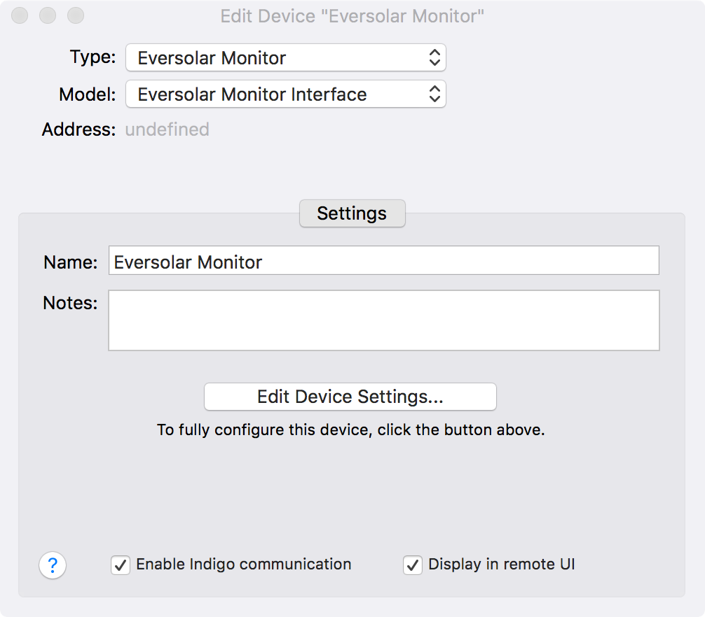
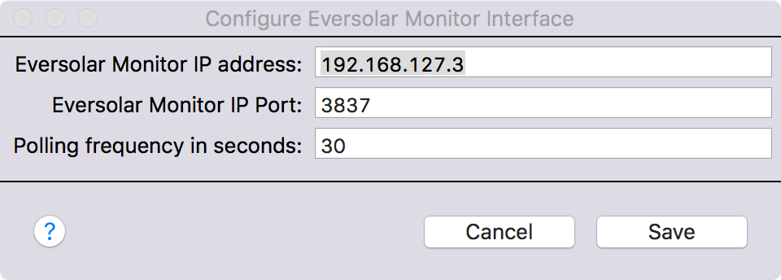

[Eversolar Monitor](https://github.com/solmoller/eversolar-monitor/) is an application to capture data and create statistics from Eversolar/zeversolar solar PV inverters. The application runs on a small Linux server, such as a Raspberry Pi, directly connected via an RS485 interface to the inverter. This plugin extends the [Indigo Domotics Indigo](http://www.indigodomo.com/index.html) Mac home automation application to read data from the Eversolar Monitor application & make it available as Indigo device states.

## Installation

1) Download the [latest release](https://github.com/smudger4/EversolarMonitor/releases) to the Mac running Indigo &amp; unzip it if necessary
2) Double-click on the EversolarMonitor.indigoPlugin file: Indigo will ask if you would like to install it
3) The plugin’s configuration screen will pop up. Just hit Save to carry on.

## Configuration

1) From within the Indigo Devices list, click “New” and create a device representing Eversolar Monitor. Use the "Plugin" device type and then select "EversolarMonitor" as the plugin. Finally, select the "Eversolar Monitor Interface" model.

2) The configuration screen will be displayed. Enter the IP address of the machine that Eversolar is running on and the TCP port that it is using (3837 is the default). Finally enter how frequently the Indigo plugin should poll Eversolar Monitor for new information and then press "Save".

## Supported Operations

The plugin aeads the following data items from Eversolar Monitor & exposes as them as Indigo device states:

* Connected at
* Inverter Serial Number
* Inverter ID String
* Max PV Power Time
* Max PV Power
* Energy Today
* Total Energy
* AC Current
* Operations Mode
* AC Frequency
* AC Voltage
* Uptime Hours<
* Internal Temperature
* PV Voltage
* PV Current
* PV Power
* Timeout Count
* Last Updated
* PV Current 2
* PV Voltage 2
* Impedence
* Total Day KWh
* Total Power

Indigo V5 or later is required

## Release History

* 1.0.1 - 17 January 2018: repackaged for Indigo Plugin Library
* 1.0.0 - 4 June 2013: initial release

[Back to Index](https://smudger4.github.io)